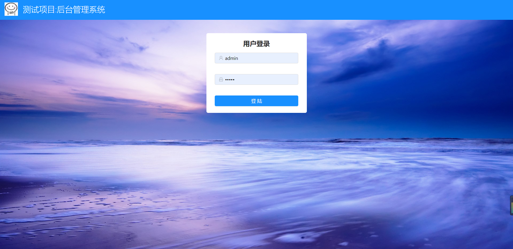
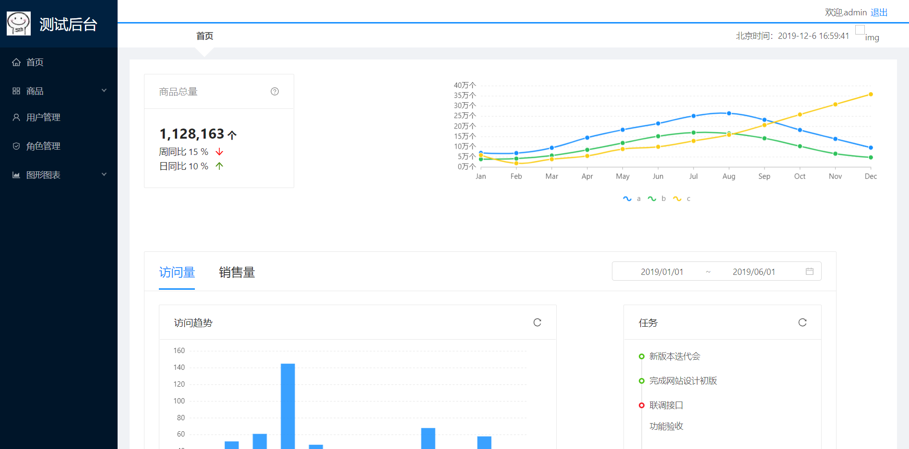
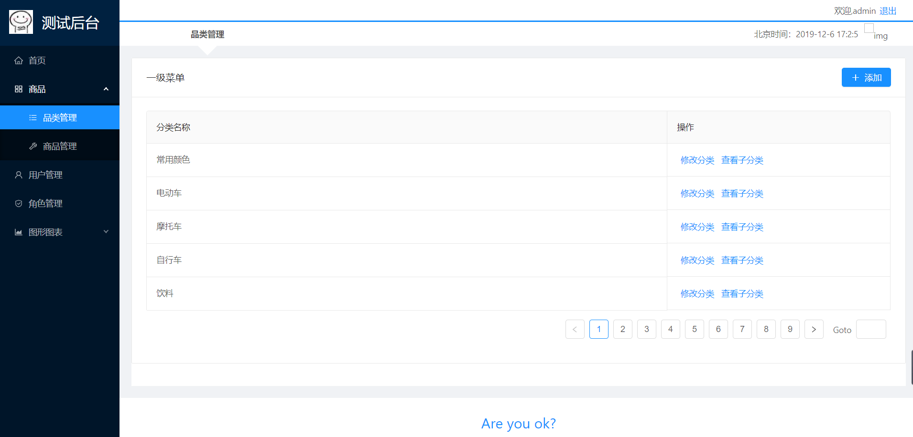
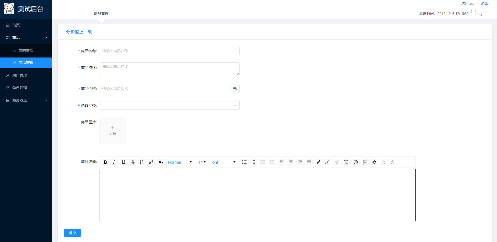

# 测试后台管理系统，打包版本。

[**对应前端代码链接[JS版本]**](https://github.com/lmxyjy/admin_client)

[**对应前端代码链接[TS版本]**](https://github.com/lmxyjy/admin_client_ts)

**个人根据网络教程编写的测试后台管理系统，将前端代码打包完毕放置到了node后台中的public文件目录下。**

**个人选取的技术如下：**

1. **环境搭建:** React官方脚手架 `create-react-app` 。

2. **框架部分:** 选择了`React`。

3. **路由部分：** 选择了`React-router`。

4. **数据管理部分:** 选择了`Redux` + `React-redux` 管理部分数据。使用`Redux-thunk`中间件做了异步数据请求。

5. **UI组件库:** 选择了`Ant Design`。

6. **Css样式:** 选择了预编译语言`Less`。

7. **数据请求:** 选择了`axios` 。

8. **项目图表部分:** 简单使用了`echarts` 。
   
9.  **富文本编辑器部分:** 使用了`react-draft-wysiwyg` 。

10. **百度天气接口:** 使用了`jsonp`库做jsonp请求。(貌似挂掉了)。

**启动方法**

- 下载了本仓库后。在项目根目录下执行: `npm install` 安装所需依赖。
- 在项目根目录启动命令行：`npm start` 。
- 项目启动后：在浏览器中输入 `http://localhost:5000
`访问系统。
- 系统的初始的管理员账号密码为: 

    账号:`admin` 
    
    密码:`admin`

**部分页面展示：**
  
1. **登录页：**

    

2. **首页：**

    

3. **商品/品类管理：**

    

4. **商品/商品管理/添加商品：**

    

**尾巴:**

这个项目是整合使用一下个人react全家桶开发技术的一个练习测试项目。感谢提供网络资源的api接口等的教程方。

**权限管理方面：** 因为时间原因，只是实现了菜单的权限管理。并没有去实现动态路由渲染。

